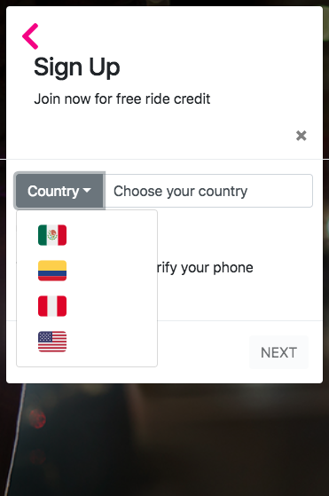
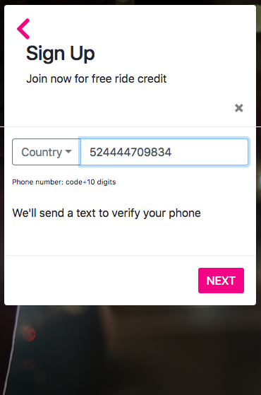
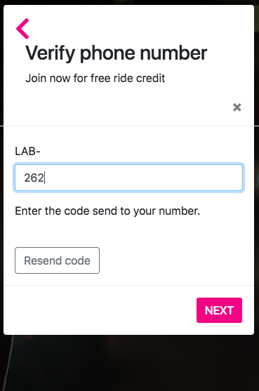
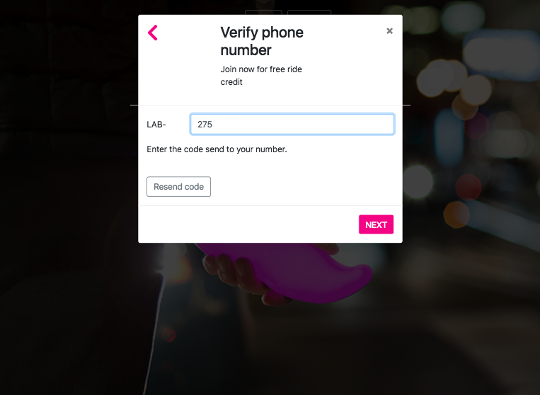

# Lyft

* **Curso:** _Crea tu propia red social_
* **Unidad:** _Agiliza tu desarrollo_

***

En este ejercicio se desarrolla una web-app que replica el sitio de Lyft, se utiliza; Responsive Web Design, Bootstrap y jQuery.

## Visualización mobile 

##Visualización desktop

